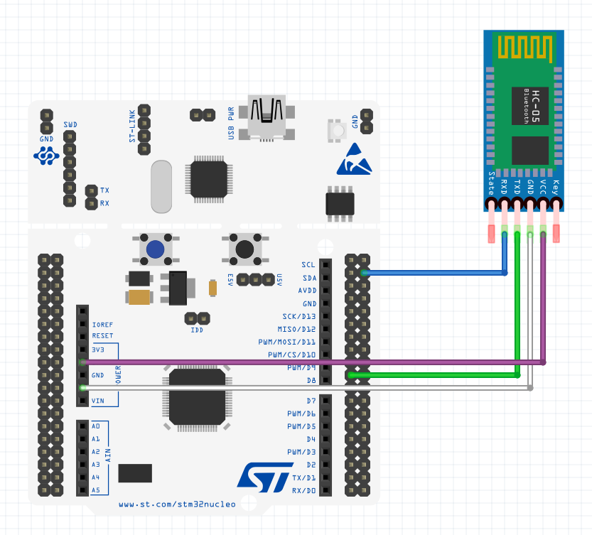

# Bluetooth Communication Demo using HAL Library on NUCLEOF401RE 

<p align="center">
  
</p>

- LED ON|OFF application was made on this repo by using STM32F4 series MCU and HC05 Bluetooth module.

- Data received by UART receive interrupt. The received data has been sent back. (echo)

## Cloning the Repo
```bash
$ git clone https://github.com/fevz10/roiSelector.git
```

## Wiring

<p align="center">
  
</p>

| NUCLEO PIN    | HC05 PIN       |
| --------------|----------------|
| 5V            | VCC            |
| GND           | GND            |
| PC6(USART6-TX)| RXD            |
| PC7(USART6-RX)| TXD            |


